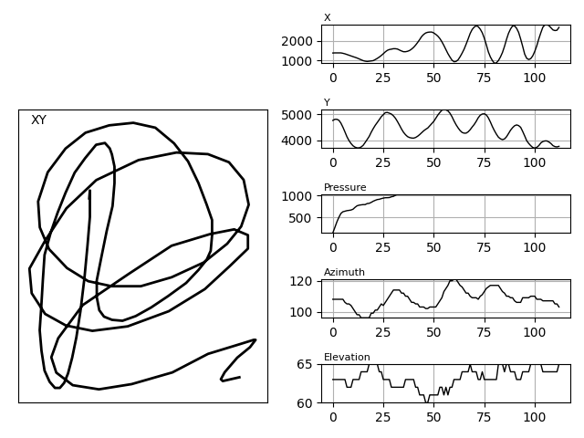

# Python reader for the MCYT Signature dataset

This Python script allows to visualize the MCYT signatures in a format 
that looks like the one provided by the executable file bundled with the
dataset.

```
Usage:

python read-fpg.py [filenames]
```
See below the preview for the one of the images in the dataset.

